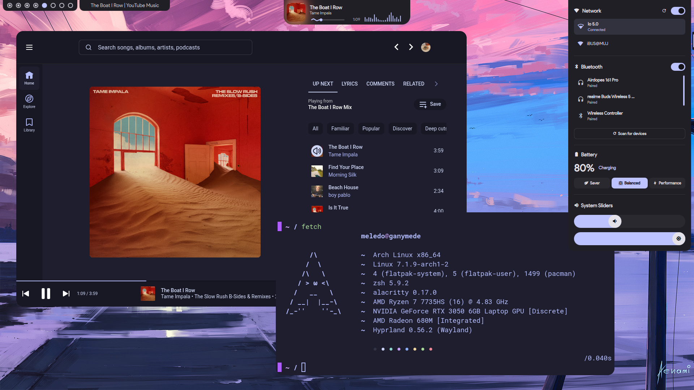
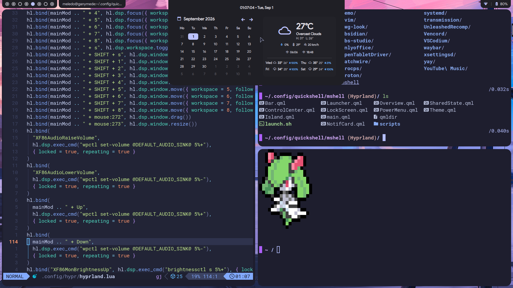
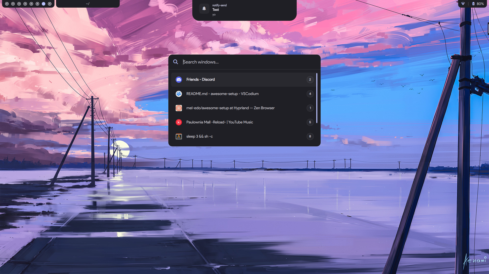
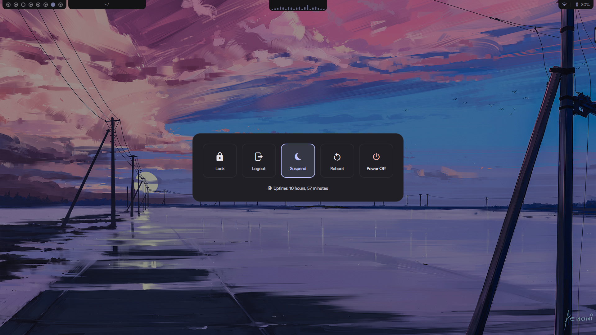

# mshell-dots

https://github.com/user-attachments/assets/303bab8e-1210-4601-a3fc-da12fd016163

---

## Hyprland Rice

*Made on a 1920x1080 display*

- **Wallpapers from:** [ArtStation](https://www.artstation.com/aenamiart) & [Wallpaper Engine](https://store.steampowered.com/app/431960/Wallpaper_Engine/)
- **Window Manager:** [Hyprland](https://github.com/hyprwm/Hyprland)
- **Terminal:** [alacritty](https://github.com/alacritty/alacritty)
- **Shell:** [zsh](https://www.zsh.org/)
- **Desktop shell / bar:** [Quickshell](https://github.com/quickshell-mirror/quickshell)
- **Color theming:** [matugen](https://github.com/InioX/matugen)
- **System fetch:** [fastfetch](https://github.com/fastfetch-cli/fastfetch)
- **Cursor theme:** [catppuccin-dark](https://github.com/catppuccin/cursors)
- **Folder theme:** [Papirus](https://github.com/PapirusDevelopmentTeam/papirus-icon-theme) with [Catppuccin folder colors](https://github.com/catppuccin/papirus-folders)
- **GTK theme:** [catppuccin](https://github.com/catppuccin/gtk)
- **QT theme:** [catppuccin with kvantum](https://github.com/catppuccin/Kvantum)

<br/>

<p align="center">
  <a href="images/1.png"></a>
  <a href="images/2.png"></a>
  <a href="images/3.png"></a>
  <a href="images/4.png"></a>
</p>

---

## Configuration you need to change
 
You'll want to edit these.
 
| File | What to change |
|---|---|
| `config/quickshell/mshell/scripts/calendar/weather.sh` | `API_KEY` and `CITY`. Get from [openweathermap.org](https://openweathermap.org/api) |
| `config/hypr/settings.json` → `wallpaperDir` | Add path to your wallpaper dir. Wallpaper picker looks in your wallpaper dir by default and also picks up Wallpaper Engine wallpapers if you have those. |
| `config/hypr/hyprland.lua` → `hl.monitor(...)` | `output = ""`, `mode = "1920x1080@120"` | Blank output matches your first/only monitor; set it explicitly and adjust the mode/refresh rate for multi-monitor setups. |
| `config/hypr/hyprland.lua` → env vars | `NVD_BACKEND`, `LIBVA_DRIVER_NAME`, `__GLX_VENDOR_LIBRARY_NAME`. Modify according to your [hardware](https://wiki.hypr.land/Nvidia/) |
| `config/hypr/hypridle.conf` | Modify lock, suspend timers |
 
---
 
## Install Instructions
 
### Required programs
 
(For yay on Arch Linux)
 
```
yay -S --needed hyprland hypridle hyprpicker quickshell-git matugen cava awww grim slurp wl-clipboard tesseract playerctl brightnessctl 
```

#### Optional Programs

```
copyq, hyprsunset, fastfetch, mpv, polkit-gnome, pokemon-colorscripts-git, gpu-screen-recorder, catppuccin-cursors-mocha, catppuccin-gtk-theme-mocha
```
 
### Manual method
 
1. `git clone -b Hyprland https://github.com/mel-edo/awesome-setup mshell-dots`
2. Backup your `~/.config` folder (or create it if it doesn't exist)
3. `cp -r ~/mshell-dots/config/* ~/.config`
4. `cp -r ~/mshell-dots/fonts/* ~/.local/share/fonts`
5. `fc-cache -v -f`
6. `cp ~/mshell-dots/.zprofile ~/mshell-dots/.zshrc ~/`
7. Go through [**Configuration you need to change**](#configuration-you-need-to-change) above before launching
8. mshell launches automatically via Hyprland's autostart. Run it manually using launch script - `~/.config/quickshell/mshell/launch.sh`

---
 
## Autostart
 
Runs on Hyprland startup. Change as you wish
 
1. `dbus-update-activation-environment`
2. polkit-gnome auth agent
3. `hyprsunset -t 5000`
4. `hypridle`
5. `awww-daemon`
6. `discord`, `zen-browser`
7. `kdeconnect-indicator`
8. `launch.sh` - Starts the Quickshell desktop shell 
9. Applies `catppuccin-mocha-dark-cursors`
 
---
 
## Keybinds & Rules
 
For the complete list of shortcuts, media controls, gestures, and window/layer rules, see **[KEYBINDS.md](KEYBINDS.md)**.
 
| Keybind | Action |
|---|---|
| `SUPER + Return` | Open terminal (`alacritty`) |
| `SUPER + A` | Toggle launcher |
| `SUPER + Space` | Toggle floating, resize + center |
| `SUPER + Q` | Close window |
| `SUPER + W` | Toggle overview |
| `SUPER + Escape` | Toggle power menu |
  
---
 
## Previous Rices

### Lavender (AwesomeWM)

<a href="https://raw.githubusercontent.com/mel-edo/awesome-setup/Lavender/images/2.png"></a>
<a href="https://raw.githubusercontent.com/mel-edo/awesome-setup/Lavender/images/1.png"></a>

Catppuccin Lavender themed Rice

- **Branch:** [`Lavender`](https://github.com/mel-edo/awesome-setup/tree/Lavender)
- **Window Manager:** [AwesomeWM](https://github.com/awesomeWM/awesome)
- **Bar:** [Polybar](https://github.com/polybar/polybar)
- **Compositor:** [picom-pijulius](https://github.com/pijulius/picom)
- **Wallpaper:** [ArtStation](https://www.artstation.com/artwork/4Xa124)

<br clear="both" />

### Mauve (AwesomeWM)

<a href="https://raw.githubusercontent.com/mel-edo/awesome-setup/Mauve/images/2.png"></a>
<a href="https://raw.githubusercontent.com/mel-edo/awesome-setup/Mauve/images/1.png"></a>

Catppuccin Mauve themed Rice

- **Branch:** [`Mauve`](https://github.com/mel-edo/awesome-setup/tree/Mauve)
- **Window Manager:** [AwesomeWM](https://github.com/awesomeWM/awesome)
- **Wallpaper:** [ArtStation](https://www.artstation.com/artwork/4bX4eY)

<br clear="both" />

---
 
### Sources of inspiration:

- [caelestia](https://github.com/caelestia-dots/shell)
- [Rexcrazy804](https://github.com/Rexcrazy804/Zaphkiel)
- [Devvvmn](https://github.com/Devvvmn/ActivSpot)
---

### Star History: <a href="https://github.com/mel-edo/awesome-setup/stargazers"></a>

<a href="https://www.star-history.com/#mel-edo/awesome-setup&Date">
 <picture>
   <source media="(prefers-color-scheme: dark)" srcset="https://api.star-history.com/svg?repos=mel-edo/awesome-setup&type=Date&theme=dark" />
   <source media="(prefers-color-scheme: light)" srcset="https://api.star-history.com/svg?repos=mel-edo/awesome-setup&type=Date" />
   
 </picture>
</a>
